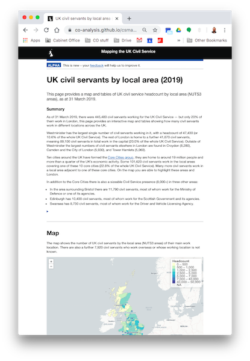

---
output:
  xaringan::moon_reader:
    css: ["default", "coslide.css", "coslide-fonts.css"]
    seal: false
    lib_dir: libs
    nature:
      highlightStyle: github
      highlightLines: true
      countIncrementalSlides: false
      ratio: "16:9"

---

class: title-slide, middle, right

.title-text[Mapping in R]

.title-sub[2: making interactive maps in R with leaflet]

.title-spacer[]

.title-presenter[Matt Kerlogue]

.title-date[9 January 2019]

---

# The data we'll be using


.pull-left[
As with the first session, [introduction to mapping](static_map.html), we'll be using the Cabinet Office's [Civil Service Statistics 2019](https://www.gov.uk/government/statistics/civil-service-statistics-2019). Specifically, the [machine readable](https://www.gov.uk/government/uploads/system/uploads/attachment_data/file/836368/Statistical-tables-Civil-Service-Statistics-2019-machine-readable-headcounts-version-V2.csv/preview) csv.

``` {r, eval=FALSE}

# download the civil service statistics data
civil_service_stats_2019 <- readr::read_csv(
      "https://assets.publishing.service.gov.uk/
      government/uploads/system/uploads/
      attachment_data/file/836368/Statistical-
      tables-Civil-Service-Statistics-2019-
      machine-readable-headcounts-version-V2.csv",
  col_types = paste0(rep("c", 12), collapse =""))

```

]

.pull-right[

]

---

# Leaflet

.pull-left[
The `{leaflet}` package allows R to work with the [Leaflet.js](https://leafletjs.com/) library to enable interactive mapping.

``` {r, eval=FALSE}
leaflet() %>%
  addTiles() %>%
  addMarkers(lat = 51.501861, lng = -0.129260, popup = "1 Horse Guards Road", ) %>%
  setView(lat = 51.501861, lng = -0.129260, zoom = 15)

```

]

.pull-right[
``` {r, echo=FALSE}
library(leaflet)

leaflet(width = 600, height = 400) %>%
  addTiles() %>%
  addMarkers(lat = 51.501861, lng = -0.129260, popup = "1 Horse Guards Road")

```
]

---

.pull-left[
We'll use data from Table 15 of the Civil Service Statistics, which shows the number of civil servants working in NUTS3* areas.

``` {r, eval = FALSE}

cs_nuts3 <- cs19_t15 %>%
  filter(category_1 != "All employees", 
         category_2 == "All employees", 
         category_4 == "Total") %>%
  group_by(category_1) %>%
  summarise_at(vars(value), sum, na.rm = TRUE) %>%
  rename(NUTS318NM = category_1) %>%
  full_join(nuts3_codes) %>%
  mutate(pc = formattable::percent(
    value/445480),
    value = formattable::comma(value, digits = 0))

```

.small[
\* NUTS3 are groupings of local authorities that have a population size of between 150,000 and 800,000 residents.
]

]

```{r include=FALSE}
# load packages
library(tidyverse)
library(geojsonio)
library(sp)
library(leaflet)
library(DT)
library(knitr)

# urls for downloading assets
urls <- list(
  cs19_dt = "https://assets.publishing.service.gov.uk/government/uploads/system/uploads/attachment_data/file/820177/Statistical_tables_-_Civil_Service_Statistics_2019_-_machine_readable_headcounts_version.csv",
  nuts3_codes = "https://opendata.arcgis.com/datasets/3e1d40ce19494869b43a6997e7a539a2_0.geojson",
  nuts1_shapes = "https://opendata.arcgis.com/datasets/01fd6b2d7600446d8af768005992f76a_4.geojson",
  nuts2_shapes = "https://opendata.arcgis.com/datasets/48b6b85bb7ea43699ee85f4ecd12fd36_4.geojson",
  nuts3_shapes = "https://opendata.arcgis.com/datasets/473aefdcee19418da7e5dbfdeacf7b90_4.geojson"
)

# read in civil service stats and filter to table 15
cs19_t15 <- read_csv(urls$cs19_dt, col_types = "cccccccccccn", na = c("..", "-")) %>%
  filter(table == "t15")

# read in NUTS3 lookup codes
# rename the Western Isles to align with label is cs19
nuts3_codes <- geojson_read(urls$nuts3_codes, parse = TRUE) %>%
  pluck("features") %>%
  pluck("properties") %>%
  mutate(
    NUTS318NM = case_when(
      NUTS318CD == "UKM64" ~ "Na h-Eileanan Siar",
      TRUE ~ NUTS318NM))

# clean up cs stats table
cs_nuts3 <- cs19_t15 %>%
  filter(category_1 != "All employees", category_2 == "All employees", category_4 == "Total") %>%
  group_by(category_1) %>%
  summarise_at(vars(value), sum, na.rm = TRUE) %>%
  rename(NUTS318NM = category_1) %>%
  full_join(nuts3_codes) %>%
  mutate(pc = formattable::percent(
    value/445480),
    value = formattable::comma(value, digits = 0))

# Read in NUTS3 shapes
nuts3_spdf <- geojson_read(urls$nuts3_shapes, what = "sp")

# Read in NUTS1 shapes, select only London
nuts1_spdf <- geojson_read(urls$nuts1_shapes, what = "sp")
london_spdf <- nuts1_spdf[nuts1_spdf$nuts118cd == "UKI",]

# Read in NUTS2 shapes, select Greater Manchester
nuts2_spdf <- geojson_read(urls$nuts2_shapes, what = "sp")
manchester_spdf <- nuts2_spdf[nuts2_spdf$nuts218cd == "UKD3",]

# Select remaining Core Cities from NUTS3
core_cities <- c(Birmingham = "UKG31", Bristol = "UKK11", Cardiff = "UKL22", 
                 Glasgow = "UKM82", Leeds = "UKE42", Liverpool = "UKD72", 
                 Newcastle = "UKC22", Nottingham = "UKF14", Sheffield = "UKE32")
cities_spdf <- nuts3_spdf[nuts3_spdf$nuts318cd %in% core_cities,]

# merge nuts3 shapes with data
leaf_dt <- sp::merge(nuts3_spdf, cs_nuts3, by.x = "nuts318cd", by.y = "NUTS318CD")

```

.pull-right[
``` {r, echo=FALSE}

cs_nuts3

```
]

---

.pull-left[

To map the data we need to download the releant spatial data from the Geoportal and merge it with our statistical data

```{r, eval=FALSE}

nuts3_spdf <- geojson_read("https://opendata.arcgis.com/datasets/"
   "473aefdcee19418da7e5dbfdeacf7b90_4.geojson", 
   what = "sp")

leaf_dt <- sp::merge(nuts3_spdf, cs_nuts3, 
                     by.x = "nuts318cd", 
                     by.y = "NUTS318CD")

```
]

.pull-right[

``` {r, echo=FALSE}

as_tibble(leaf_dt)

```

]

---

.pull-left[
``` {r, eval=FALSE}

leaflet(leaf_dt) %>%
  addTiles() %>%
  addPolygons()

```

.small[
Now we can feed our merge spatial and statistical data to leaflet:
1. Call leaflet
2. Add tiles (your 'background' map)
3. Add polygons

]

]

.pull-right[
``` {r, echo=FALSE}

leaflet(leaf_dt, width = 600, height = 500) %>%
  addTiles() %>%
  addPolygons()

```
]

---

.pull-left[

.small[
The default set of 'tiles' is from the Open Street Map project, but there are a large number of other providers that you can access through the `leaflet::addProviderTiles()` function and the `leaflet::providers` object.

On the right here are six options:
1. Open Street Map (the default)
2. ESRI National Geographic World Map
3. CartoDB Positron
4. CartoDB DarkMatter
5. Stamen
6. Stamen Watercolour

Going forward we'll use the CartoDB Positron map as this provides a neutral background - we're interested in some geographic signposting to help people place the data, but ultimately we're visualising choropleth data so we don't need the full detail provdied by a traditional "street map".
]
]

.pull-right[
``` {r, echo=FALSE}

leaflet(width = 600, height = 100) %>%
  addTiles() %>%
  setView(lat = 51.501861, lng = -0.129260, zoom = 15)

leaflet(width = 600, height = 100) %>%
  addProviderTiles(providers$Esri.NatGeoWorldMap) %>%
  setView(lat = 51.501861, lng = -0.129260, zoom = 10)

leaflet(width = 600, height = 100) %>%
  addProviderTiles(providers$CartoDB.Positron) %>%
  setView(lat = 51.501861, lng = -0.129260, zoom = 15)

leaflet(width = 600, height = 100) %>%
  addProviderTiles(providers$CartoDB.DarkMatter) %>%
  setView(lat = 51.501861, lng = -0.129260, zoom = 10)

leaflet(width = 600, height = 100) %>%
  addProviderTiles(providers$Stamen) %>%
  setView(lat = 51.501861, lng = -0.129260, zoom = 10)

leaflet(width = 600, height = 100) %>%
  addProviderTiles(providers$Stamen.Watercolor) %>%
  setView(lat = 51.501861, lng = -0.129260, zoom = 10)

```
]

---

.pull-left[
``` {r, eval=FALSE}

leaflet(leaf_dt) %>%
  addProviderTiles(providers$CartoDB.Positron) %>%  #<<
  addPolygons()

```

.small[
We've replaced `addTiles()` with a call to `addProviderTiles` and called the CartoDB refernece data stored in the `providers` object.

]

]

.pull-right[
``` {r, echo=FALSE}

leaflet(leaf_dt, width = 600, height = 500) %>%
  addProviderTiles(providers$CartoDB.Positron) %>%  #<<
  addPolygons()

```
]


---

.pull-left[
``` {r, eval=FALSE}

leaflet(leaf_dt) %>%
  addProviderTiles(...) %>%  
  addPolygons(color = "#aaaaaa",                      #<<
              weight = 1,                             #<<
              fillColor = ~bincol(value),             #<<
              fillOpacity = 0.8)                      #<<

```

.small[
We've now expanded our call to addPolygons to:
1. change the polygon border line colour and line weight
2. change the polygon fill colour according to a custom function `bincol`
3. change the transparency of the fill to 20% (0.8 = 1-0.2)

`bincol` is a function that applies colour coding from the `leaflet::colorBin` function factory.

]

``` {r, eval=FALSE}

bincol <- colorBin(
  palette = "YlGnBu",
  domain = leaf_dt$value,
  bins = c(0, 500, 1000, 2500, 5000, 
           7000, 40000, 50000),
  pretty = FALSE,
  na.color = "#eeeeee")

```

]

.pull-right[
``` {r, echo=FALSE}

bincol <- colorBin(palette = "YlGnBu",
                   domain = leaf_dt$value,
                   bins = c(0, 500, 1000, 2500, 5000, 7000, 40000, 50000),
                   pretty = FALSE,
                   na.color = "#eeeeee")

leaflet(leaf_dt, width = 600, height = 500) %>%
  addProviderTiles(providers$CartoDB.Positron) %>%  #<<
  addPolygons(color = "#aaaaaa",
              weight = 1,
              fillColor = ~bincol(value),
              fillOpacity = 0.8)

```
]


---

.pull-left[
``` {r, eval=FALSE}

leaflet(leaf_dt) %>%
  addProviderTiles(...) %>%  
  addPolygons(...) %>%
  addLegend(position = "topright",                   #<<
            pal = bincol,                            #<<
            values = ~leaf_dt$value,                 #<<
            title = "Headcount",                     #<<
            opacity = 0.8)                           #<<

```

.small[
We can also add a legend that tells the viewer what the colours actually mean.

]

]

.pull-right[
``` {r, echo=FALSE}

leaflet(leaf_dt, width = 600, height = 500) %>%
  addProviderTiles(providers$CartoDB.Positron) %>%  #<<
  addPolygons(color = "#aaaaaa",
              weight = 1,
              fillColor = ~bincol(value),
              fillOpacity = 0.8) %>%
  addLegend(position = "topright", pal = bincol, 
            values = ~leaf_dt$value, 
            title = "Headcount", opacity = 0.8)

```
]

---

.pull-left[
``` {r, eval=FALSE}

leaflet(leaf_dt) %>%
  addProviderTiles(...) %>%  
  addPolygons(...,
    popup = ~paste(NUTS318NM, value, sep = ": "))     #<<
  addLegend(...)

```

.small[

The legend tells us the broad category... but what about a specific area, wouldn't it be great to be able to click on an area and find out their underlying value. We can do that by adding the `popup` argument to `addPolygons`. You can provide a specific column in your data or, as shown here, paste columns together.

]

]

.pull-right[
``` {r, echo=FALSE}

leaflet(leaf_dt, width = 600, height = 500) %>%
  addProviderTiles(providers$CartoDB.Positron) %>%  #<<
  addPolygons(color = "#aaaaaa",
              weight = 1,
              fillColor = ~bincol(value),
              fillOpacity = 0.8,
              popup = ~paste(NUTS318NM, value, sep = ": ")) %>%
  addLegend(position = "topright", pal = bincol, 
            values = ~leaf_dt$value, 
            title = "Headcount", opacity = 0.8)

```
]


---

.pull-left[
``` {r, eval=FALSE}

leaflet(leaf_dt) %>%
  addProviderTiles(                                   
    providers$CartoDB.PositronNoLabels) %>%           #<<
  addMapPane("dt", zIndex = 410) %>%                  #<<
  addMapPane("labs", zIndex = 420) %>%                #<<
  addPolygons(..., 
     options = pathOptions(pane = "dt")) %>%          #<<
  addProviderTiles(                                   #<<
    providers$CartoDB.PositronOnlyLabels,             #<<
    options =                                         #<<
      providerTileOptions(pane = "labs")) %>%         #<<
  addLegend(...)

```

.small[

Just like `ggplot2::ggplot()` the elements in leaflet are additive, so each call builds on the next. This means that we can't really see things like place labels that might be helpful.

What we can do though, is use a version of the tiles that excludes the labels as our basemap, add our statistical data, and then add the labels on top. We also need to create a separate "pane" for our data and the labels, this ensures that the labels definitely sit on top of the data.

]

]

.pull-right[
``` {r, echo=FALSE}

leaflet(leaf_dt, , width = 600, height = 500) %>%
  addProviderTiles(providers$CartoDB.PositronNoLabels) %>%
  addMapPane("dt", zIndex = 410) %>%
  addMapPane("labs", zIndex = 420) %>%
  addPolygons(color = "#aaaaaa",
              weight = 1,
              fillColor = ~bincol(value),
              popup = ~paste(NUTS318NM, value, sep = ": "),
              fillOpacity = 0.8,
              options = pathOptions(pane = "dt")) %>%
  addProviderTiles(providers$CartoDB.PositronOnlyLabels, 
                   options = providerTileOptions(pane = "labs")) %>%
  addLegend(position = "topright",
            pal = bincol, 
            values = ~leaf_dt$value, 
            title = "Headcount",
            opacity = 0.8)

```
]


---


.pull-left[
``` {r, eval=FALSE}

leaflet(leaf_dt) %>%
  addProviderTiles(...) %>%
  addMapPane(...) %>%
  addPolygons(...) %>%
  addPolygons(                                      #<<
    data = london_spdf,                             #<<
    color = "#F47738",                              #<<
    opacity = 1,                                    #<<
    weight = 2,                                     #<<
    fill = FALSE,                                   #<<
    group = "London",                               #<<
    options = pathOptions(pane = "dt")) %>%         #<<
  addProviderTiles(...) %>%
  addLegend(...) %>%
  addLayersControl(                                 #<<
    overlayGroups = c("London", "Core Cities"),     #<<
    position = "bottomright",                       #<<
    options =                                       #<<
      layersControlOptions(collapsed = FALSE)) %>%  #<<
  hideGroup(c("London", "Core Cities"))             #<<

```

.small[

Finally, we can also add additional data layers. Here we are adding outlines for London and the 10 "Core Cities", we've also added a control that allows these outlines to be turned on and off by the viewer.

]

]

.pull-right[
``` {r, echo=FALSE}

leaflet(leaf_dt, , width = 600, height = 500) %>%
  addProviderTiles(providers$CartoDB.PositronNoLabels) %>%
  addMapPane("dt", zIndex = 410) %>%
  addMapPane("labs", zIndex = 420) %>%
  addPolygons(color = "#aaaaaa",
              weight = 1,
              fillColor = ~bincol(value),
              popup = ~paste(NUTS318NM, value, sep = ": "),
              fillOpacity = 0.8,
              options = pathOptions(pane = "dt")) %>%
  addPolygons(data = london_spdf,
              color = "#F47738",
              opacity = 1,
              weight = 2,
              fill = FALSE,
              group = "London",
              options = pathOptions(pane = "dt")) %>%
  addPolygons(data = manchester_spdf,
              color = "#F47738",
              opacity = 1,
              weight = 3,
              fill = FALSE,
              group = "Core Cities",
              options = pathOptions(pane = "dt")) %>%
  addPolygons(data = cities_spdf,
              color = "#F47738",
              opacity = 1,
              weight = 3,
              fill = FALSE,
              group = "Core Cities",
              options = pathOptions(pane = "dt")) %>%
  addProviderTiles(
    providers$CartoDB.PositronOnlyLabels, 
    options = providerTileOptions(pane = "labs")) %>%
  addLegend(position = "topright", 
            pal = bincol, 
            values = ~leaf_dt$value, 
            title = "Headcount", 
            opacity = 0.8) %>%
  addLayersControl(
    overlayGroups = c("London", "Core Cities"), 
    position = "bottomright",
    options = layersControlOptions(collapsed = FALSE)) %>%
  hideGroup(c("London", "Core Cities"))

```
]

---

.pull-left[
This example is based on an interactive map and datatables that have been produced to help Civil Service Local and the Places for Growth programme. You can view the full interactive document here: https://co-analysis.github.io/csmapping/cs_lad_2019.html.

]

.pull-right[


]
