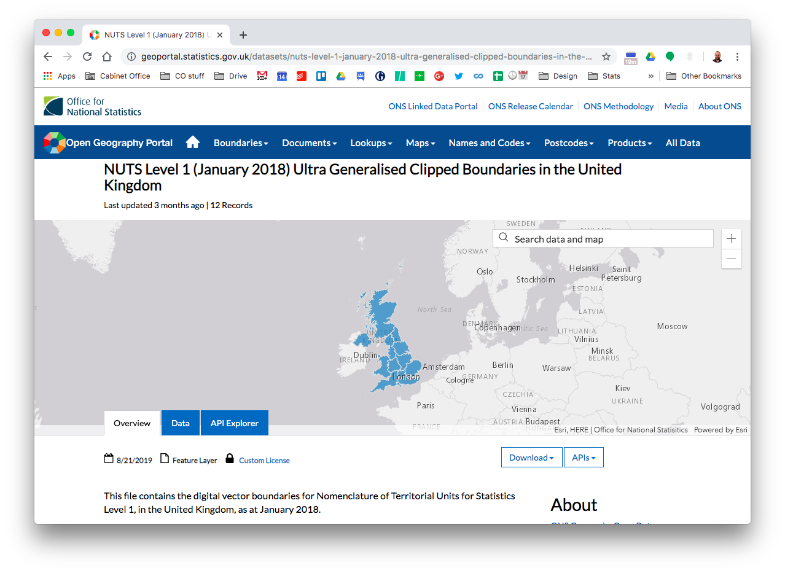

---
output:
  xaringan::moon_reader:
    css: ["default", "coslide.css", "coslide-fonts.css"]
    seal: false
    lib_dir: libs
    nature:
      highlightStyle: github
      highlightLines: true
      countIncrementalSlides: false
      ratio: "16:9"

---

class: title-slide, middle, right

.title-text[Mapping in R]

.title-sub[1: making static maps in R with ggplot2]

.title-spacer[]

.title-presenter[Matt Kerlogue]

.title-date[29 November 2019]

---

# The data we'll be using


.pull-left[
We'll be using the Cabinet Office's [Civil Service Statistics 2019](https://www.gov.uk/government/statistics/civil-service-statistics-2019). Specifically, the [machine readable](https://www.gov.uk/government/uploads/system/uploads/attachment_data/file/836368/Statistical-tables-Civil-Service-Statistics-2019-machine-readable-headcounts-version-V2.csv/preview) csv.

``` {r, eval=FALSE}

# download the civil service statistics data
civil_service_stats_2019 <- readr::read_csv(
      "https://assets.publishing.service.gov.uk/
      government/uploads/system/uploads/
      attachment_data/file/836368/Statistical-
      tables-Civil-Service-Statistics-2019-
      machine-readable-headcounts-version-V2.csv",
  col_types = paste0(rep("c", 12), collapse =""))

```

]

.pull-right[

]

---

# ONS Geoportal

.pull-left[
The ONS Geoportal (https://geoportal.statistics.gov.uk/), provides an extensive array of geographical information for mapping statistical outputs. Including:
* **boundaries** - the shapes of geographical areas
* **centroids** - point-based geographical data (including population weighted centroids)
* **lookups** - tables to convert from one geography to another

]

.pull-right[

]

---


---

.pull-left[

``` {r setup, include=FALSE}
library(tidyverse)
library(sf)

# download the civil service statistics data
civil_service_stats_2019 <- readr::read_csv("https://assets.publishing.service.gov.uk/government/uploads/system/uploads/attachment_data/file/836368/Statistical-tables-Civil-Service-Statistics-2019-machine-readable-headcounts-version-V2.csv", col_types = paste0(rep("c", 12), collapse =""))

sfdt <- st_read("https://opendata.arcgis.com/datasets/01fd6b2d7600446d8af768005992f76a_4.geojson")

```


``` {r, echo=TRUE}
t13_dt <- civil_service_stats_2019 %>%
  filter(table == "t13",
         category_2 == "All employees",
         category_4 == "Total") %>%
  mutate(value = as.numeric(value)) %>%
  group_by(category_1) %>%
  summarise(total = sum(value, na.rm = TRUE))

```

* Filter to table T13
* Filter to the total number of all employees (by region)
* Convert to numeric
* Group by region (`category_1`)
* Sum the totals

]

--
.pull-right[

``` {r, echo=FALSE}
civil_service_stats_2019 %>% filter(table == "t13") %>% head(6)
```


``` {r, echo=FALSE}
t13_dt
```

]

---


.pull-left[

``` {r}
t13_dt <- civil_service_stats_2019 %>%
  filter(table == "t13",
         category_2 == "All employees",
         category_4 == "Total") %>%
  mutate(value = as.numeric(value)) %>%
  group_by(category_1) %>%
  summarise(total = sum(value, na.rm = TRUE)) %>%
  filter(category_1 != "All employees",             #<<
         category_1 != "Not reported",              #<<
         category_1 != "Overseas") %>%              #<<
  rename(region = category_1)                       #<<

```

* Filter out the line for all employees, those for which there is no location, and those based overseas
* Rename `category_1` to something useful

]

--
.pull-right[
``` {r, echo=FALSE}
t13_dt
```
]

---

# Back to geography..

.pull-left[
Region names are "ok"... but often different folk have different ways of naming and labelling geographic entities: "Yorkshire" / "Yorkshire and the Humber" / "Yorkshire and Humberside" / "Yorks and Humber".

Let's download the UK region boundaries and see what the region names are:

``` {r, eval=FALSE}

sfdt <- st_read(
  "https://opendata.arcgis.com/datasets/
  01fd6b2d7600446d8af768005992f76a_4.geojson")

```

]

--
.pull-right[
``` {r, echo=FALSE}

as_tibble(sfdt) %>% 
  select(objectid, nuts118cd, nuts118nm, long, lat)

```
]

---

.pull-left[
``` {r, echo=FALSE}

t13_dt %>%
  select(region)

```
]

.pull-right[
``` {r, echo=FALSE}

as_tibble(sfdt) %>% 
  select(nuts118nm)

```
]

---

.pull-right[

There are many packages that enable R to handle spatial data. `{sp}`, `{rgdal}`, `{rgeos}` are the most common, but there are over 97 packages containing 'geo' in their name and 272 packages include `{sp}` in their list of imports. We'll use a slightly newer package `{sf}`.

The `{sf}` package provides an R interface for the [simple features](https://en.wikipedia.org/wiki/Simple_Features) standard - a modern and increasingly common approach for handling and distributing geographical data. It is envisaged in due course that `{sf}` will replace `{sp}` as the central geospatial pacakge for R.

`{ggplot2}` has a built in function for ploting `{sf}` objects: `geom_sf`.

``` {r, eval=FALSE}

library(sf)

ggplot(sfdt) + 
  geom_sf()

```


]

--

.pull-left[
``` {r, echo=FALSE, fig.height = 11}

ggplot(sfdt) + 
  geom_sf()

```
]

---

.pull-left[

``` {r}
t13_dt <- t13_dt %>%
  mutate(nuts118cd = case_when(
    region == "East" ~ "UKH",
    region == "East Midlands" ~ "UKF",
    region == "London" ~ "UKI",
    region == "North East" ~ "UKC",
    region == "North West" ~ "UKD",
    region == "Northern Ireland" ~ "UKN",
    region == "Scotland" ~ "UKM",
    region == "South East" ~ "UKJ",
    region == "South West" ~ "UKK",
    region == "Wales" ~ "UKL",
    region == "West Midlands" ~ "UKG",
    region == "Yorkshire and The Humber" ~ "UKE",
    TRUE ~ NA_character_
  ))

```

* Using `case_when` we can add a column `nuts11cd` to our data with codes assigned using conditional statements evaluating the `region` column.

]

--
.pull-right[
``` {r, echo=FALSE}
t13_dt
```
]

---

.pull-left[

``` {r, warning=FALSE, message=FALSE}

map_dt <- sfdt %>%
  left_join(t13_dt, by = "nuts118cd")

```

* A key benefit of `{sf}` is that it easily integrates with the tidyverse methods. Here we have used `dplyr::left_join` to attach our data to the geographical data.

]

.pull-right[
``` {r, echo=FALSE}
glimpse(map_dt)
```
]

---

.pull-right[

``` {r, eval=FALSE}

ggplot(map_dt) + 
  geom_sf(aes(fill = total))

```

* `geom_sf` allows us to plot `{sf}` objects in the same way as other data objects
* Here we have mapped the `fill` aesthetic of the regions to the `total` variable

]

--

.pull-left[
``` {r, echo=FALSE, fig.height = 11}

ggplot(map_dt) + 
  geom_sf(aes(fill = total))

```
]

---

.pull-right[

``` {r }

theme_map <- function(...) {
  theme_void() +
    theme(
      legend.position = "none",
      ...
    )
}

```

* We can create a custom ggplot theme to remove the background features

]


.pull-left[
``` {r, echo=FALSE, fig.height = 11}

ggplot(map_dt) + 
  geom_sf(aes(fill = total)) +
  theme_map()

```
]

---

.pull-right[

``` {r, eval=FALSE}

ggplot(map_dt) + 
  geom_sf(aes(fill = total), colour = "white", size = 0.2) +    #<<
  scale_fill_distiller(palette = "Oranges", direction = 1) +   #<<
  theme_map()                                                   #<<

```

* `geom_sf` allows us to plot `{sf}` objects in the same way as other data objects
* Here we have mapped the `fill` aesthetic of the regions to the `total` variable
* We have also applied a colour scale to change the map from the default blue

]

.pull-left[
``` {r, echo=FALSE, fig.height = 11}

ggplot(map_dt) + 
  geom_sf(aes(fill = total), colour = "white", size = 0.5) +
  scale_fill_distiller(palette = "Oranges", direction = 1) +
  theme_map()

```
]

---

.pull-right[

``` {r, eval=FALSE}

ggplot(map_dt) + 
  geom_sf(aes(fill = total), colour = "white", size = 0.2) +    
  geom_sf_text(aes(label = str_wrap(                              #<<
    paste(region, scales::comma(total), sep = ": "), 10)),        #<<
    hjust = 0.5, size = 3) +                                    #<<
  scale_fill_distiller(palette = "Oranges", direction = 1) +   
  theme_map()                                                   

```

* `geom_sf_text` allows us to add text labels using the coordinates from the sf object

]


.pull-left[
``` {r, echo=FALSE, fig.height = 11, warning=FALSE, message=FALSE}

ggplot(map_dt) + 
  geom_sf(aes(fill = total), colour = "white", size = 0.5) +
  geom_sf_text(aes(label = str_wrap(paste(region, scales::comma(total), sep = ": "), 10)),
               hjust = 0.5, size = 4.5) +
  scale_fill_distiller(palette = "Oranges", direction = 1) +
  theme_map()

```
]

---

.pull-right[

``` {r, eval=FALSE}

ggplot(map_dt) + 
  geom_sf(aes(fill = total), colour = "white", size = 0.2) +    
  geom_sf_text(aes(label = str_wrap(                              
    paste(region, scales::comma(total), sep = ": "), 10)),        
    hjust = 0.5, size = 3,
    nudge_x = if_else(map_dt$nuts118cd=="UKI",1.5,0)) +       #<<
  scale_fill_distiller(palette = "Oranges", direction = 1) +   
  theme_map()                                                   

```

* Let's also adjust London's label so that it's more easily visible

]


.pull-left[
``` {r, echo=FALSE, fig.height = 11, warning=FALSE, message=FALSE}

ggplot(map_dt) + 
  geom_sf(aes(fill = total), colour = "white", size = 0.5) +
  geom_sf_text(aes(label = str_wrap(paste(region, scales::comma(total), sep = ": "), 10)),
               hjust = 0.5, size = 4.5, nudge_x = if_else(map_dt$nuts118cd=="UKI",1.5,0)) +
  scale_fill_distiller(palette = "Oranges", direction = 1) +
  ylim(50,59) +
  theme_map()

```
]

